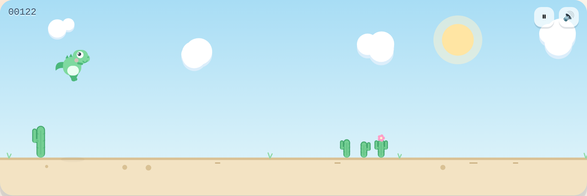
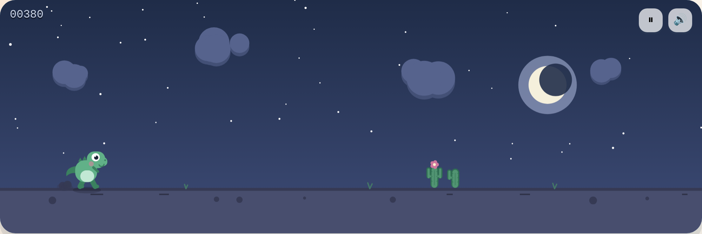
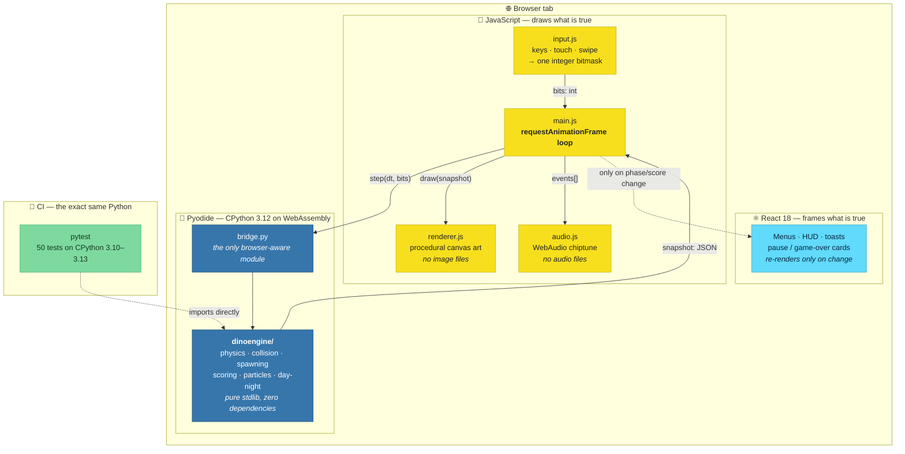
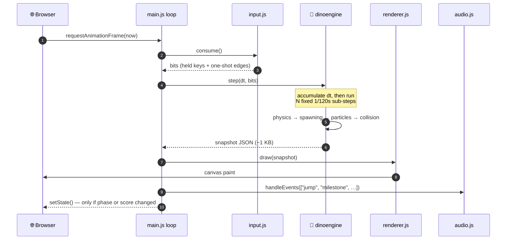
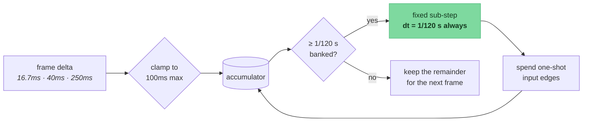
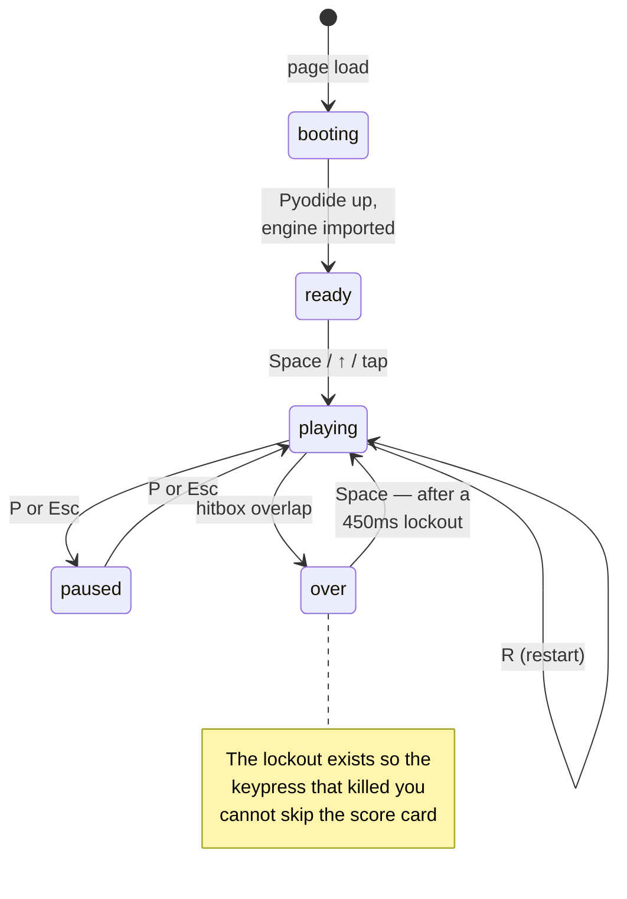
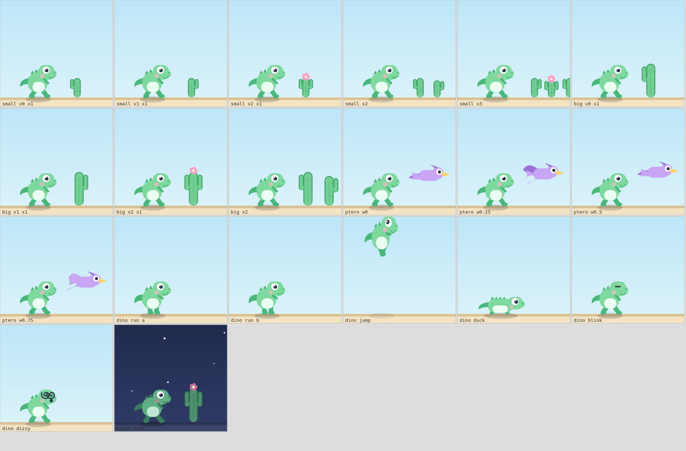
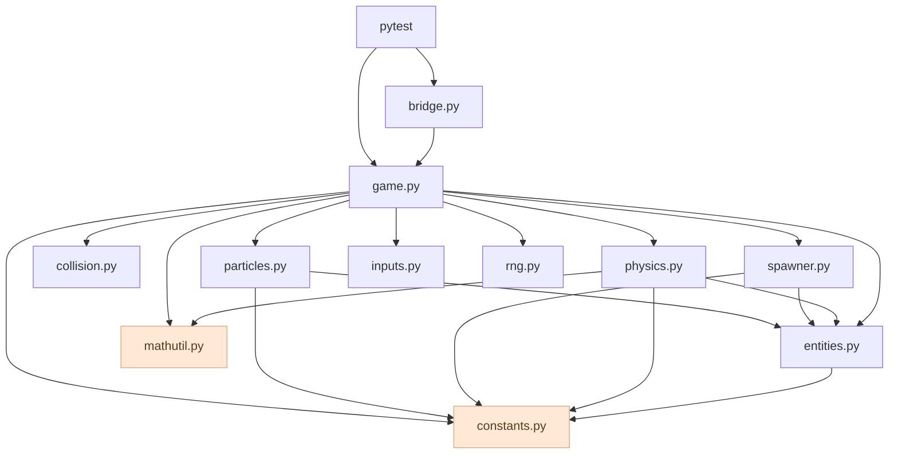
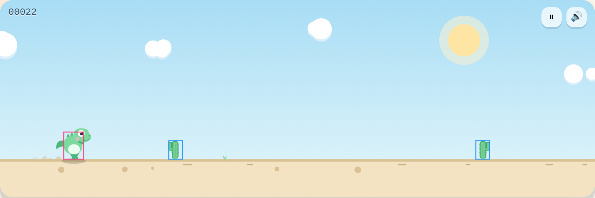
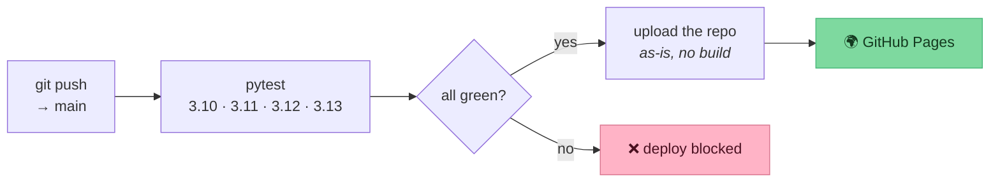

<div align="center">

# 🦖 Chomp!

**A very goofy dino runner — with its physics written in real Python, running in your browser.**

[](https://github.com/isumanthakur/CHROME-DINO-GAME/actions/workflows/tests.yml)
[](https://github.com/isumanthakur/CHROME-DINO-GAME/actions/workflows/deploy-pages.yml)


### ▶︎ **[Play it here](https://isumanthakur.github.io/CHROME-DINO-GAME/)**



</div>

---

## What this is

This started life in my first year of college as my very first project: an attempt to
clone the dinosaur game Chrome shows you when the internet is down. It was built out of
CSS keyframes and `setInterval`, and it did not really work — the jump was a fixed
animation you could not control, the collision check compared hard-coded pixel numbers
against `getComputedStyle` strings, and the score reset to zero in the wrong scope.

This is that project, rebuilt from scratch, with one deliberately odd constraint:

> **All of the game logic is written in Python.** Not transpiled, not reimplemented in
> JavaScript — the actual `.py` files in [`python/`](python/) are what runs the game, executed
> in your browser by CPython compiled to WebAssembly.

The same files are driven headlessly by **pytest** in CI. So the physics that decides
whether you cleared that cactus is the physics the test suite asserts on — there is no
second implementation to drift out of sync.

And it is a static site. No server, no build step, no `npm install`. GitHub Pages serves
the repository exactly as it is checked in.

<div align="center">

<sub><i>The day/night cycle is a single number the engine reports; every colour is interpolated from it.</i></sub>
</div>

---

## Architecture

Three layers, with a deliberately strict split of responsibility:



**The rule that keeps this honest:** Python decides *what is true*, JavaScript decides
*what it looks like*. If you want the dino to jump higher you edit
[`python/dinoengine/constants.py`](python/dinoengine/constants.py) — never the renderer.
The renderer has no opinions about gameplay and cannot have any; it receives an inert
snapshot of primitives and draws it.

### What crosses the language boundary

The contract is deliberately tiny, because it is crossed sixty times a second:

```python
step(dt: float, bits: int) -> str   # a JSON document
```

One float and one integer in, one string out. No proxy objects are built per frame.
Pyodide converts a Python `str` straight to a JavaScript string, so a frame costs one
`json.dumps` plus one `JSON.parse`.



Measured in Chromium on this machine: **p50 0.20ms, p95 0.30ms** per `step()` — about
**1.8% of a 60fps frame budget**. The Python is nowhere near the bottleneck.

---

## The two bugs worth explaining

### 1. Why the timestep is fixed

The browser hands you whatever the last frame happened to take: 16.7ms normally, 40ms
during a hitch, 250ms when you switch tabs. Integrating physics with that number directly
makes your jump height depend on your monitor's refresh rate, and lets a fast obstacle
**teleport straight through the dino** between two frames.

So `step()` does not integrate the frame delta. It banks it in an accumulator and runs as
many constant-size sub-steps as fit:



Three things fall out of this, all of them covered by tests:

| Property | Why it holds |
|---|---|
| **Same game on any monitor** | 60Hz and 144Hz produce identical state; they differ by at most *one* sub-step of leftover in the accumulator — a bound that does not grow. Measured across 5 simulated minutes: exactly 1.00 sub-steps, identical scores. |
| **No tunnelling** | At top speed an obstacle moves 9px per sub-step, comfortably less than its own width. |
| **Tab-outs cannot skip the world** | The delta is clamped before it is banked, so a 10-second background tab does not fast-forward you into a cactus. |

### 2. Why the jump has two gravities

A fixed-height jump is the single thing that made the original unplayable. This one is
variable-height, built from two cooperating mechanisms:

- while you are **rising and still holding** jump, a weaker gravity applies — holding
  floats you higher;
- the moment you **let go**, any remaining upward speed is clamped, cutting the arc short
  rather than stopping it dead.

| | peak height | airtime | clears |
|---|---|---|---|
| tap | **34px** | 0.32s | small cacti, low birds |
| hold | **141px** | 0.70s | everything |

Two grace windows do most of the work of making it feel fair — and they are the
difference between "responsive" and "broken":

- **coyote time** (80ms) — you can still jump just after leaving the ground, so a jump at
  the very lip of a landing is not silently eaten;
- **jump buffering** (120ms) — a jump pressed slightly *before* you land is remembered and
  fires on contact, so mashing during a landing works the way you expect.

> Obstacle spacing is derived from this. The minimum gap is pinned above a full jump's
> 0.70s of airtime, so there is **always** ground to land on between two obstacles, no
> matter how fast the game gets. A test measures the real gap between every live pair and
> fails if any is unclearable — it caught a genuine bug where a wide cactus cluster ate
> into the clearance behind it.

---

## Game states



---

## Features

**Game feel**

- Variable-height jump (hold to go higher), duck, and duck-in-air as a fast-fall
- Coyote time and jump buffering
- Flying pterodactyls in three bands: one you jump, one you *must* duck under, one that
  is a pure fake-out and sails over your head
- Speed that ramps for 93 seconds and then plateaus, so it gets hard but never impossible
- Day ↔ night cycle driven by score, with stars and a moon that rises as the sun sets
- Pause, restart, local high score, run count and distance — all in `localStorage`
- Keyboard, touch and swipe controls; tap the top half to jump, the bottom half to duck

**Goofiness**

- Squash and stretch on every take-off and landing, scaled by impact speed
- Dust puffs from running feet, confetti every 100 points, a poof of embarrassment on death
- Screen shake that shakes the *world* but not the sky — so it reads as impact, not an earthquake
- A dino that blinks on its own schedule, leans its pupil toward whatever it is doing, and
  gets spiral eyes when it loses
- A chiptune soundtrack of oscillators and gain envelopes — no audio files anywhere
- Encouraging nonsense ("the cacti fear you") and unlockable badges

**Art**

Everything is drawn in code with Canvas2D — there is not a single sprite file in the game.
That is why it stays crisp at any resolution and why the whole day/night palette is a
one-number interpolation.

<div align="center">

<sub><i><code>dev/sprite-sheet.html</code> — every obstacle variant and dino pose, rendered straight from <code>renderer.js</code>.<br/>
Building this is what exposed the cacti rendering as pills with a notch bitten out of them.</i></sub>
</div>

---

## Repository layout

```
CHROME-DINO-GAME/
├── index.html                  the entire site — no build step
│
├── python/                     🐍 the game. runs in the browser AND under pytest
│   ├── bridge.py               the only module that knows a browser exists
│   ├── dinoengine/
│   │   ├── constants.py        every tunable number, in one place
│   │   ├── game.py             state machine · fixed-timestep loop · scoring
│   │   ├── physics.py          variable jump · coyote time · squash & stretch
│   │   ├── collision.py        AABB overlap
│   │   ├── spawner.py          obstacle patterns · fair gaps · scenery
│   │   ├── particles.py        dust · confetti · poofs
│   │   ├── entities.py         passive dataclasses — state, never behaviour
│   │   ├── inputs.py           bitmask decoding
│   │   ├── rng.py              seeded xorshift — every run is reproducible
│   │   └── mathutil.py         clamp · lerp · smoothstep
│   └── tests/                  50 tests, no mocks — they drive the real engine
│
├── web/                        🎨 presentation only
│   ├── main.js                 React shell + the rAF loop
│   ├── renderer.js             all the art, drawn procedurally
│   ├── runtime.js              boots Pyodide, copies python/ into its filesystem
│   ├── input.js · audio.js · palette.js · messages.js · styles.css
│   └── vendor/                 React + Pyodide, vendored (see below)
│
├── dev/sprite-sheet.html       art preview harness
├── legacy/                     the original 2021 version, kept on purpose
└── docs/ARCHITECTURE.md        deeper notes on the design decisions
```

### Module dependencies

The engine's internal graph is acyclic and shallow on purpose — `constants` and
`mathutil` are leaves that everything may use, and nothing ever imports "upward":



---

## Running it locally

Any static file server will do — the only requirement is that it is served over HTTP
rather than opened as a `file://` URL, because ES modules and `fetch()` need an origin.

```bash
git clone https://github.com/isumanthakur/CHROME-DINO-GAME.git
cd CHROME-DINO-GAME
python3 -m http.server 8000
# then open http://localhost:8000
```

That is the whole setup. No `npm install`, no bundler, no virtualenv.

### Running the tests

```bash
pip install -r requirements-dev.txt
pytest
```

```
50 passed in 6.8s
```

The suite drives the real engine rather than mocking it — it plays actual games, measures
actual jump arcs, and asserts on the results. A few of the more interesting ones:

| Test | What it protects |
|---|---|
| `test_tap_clears_a_small_cactus_but_not_a_big_one` | the whole point of a variable jump |
| `test_consecutive_obstacles_are_never_unclearable` | measures every live gap in seconds of travel |
| `test_frame_rate_does_not_change_the_outcome` | 60Hz and 144Hz simulate the same world |
| `test_no_tunnelling_at_top_speed` | a thin obstacle at max speed still registers |
| `test_mid_band_pterodactyl_hits_a_standing_dino` | the "must duck" bird actually threatens you |
| `test_payload_contains_only_json_primitives` | nothing Python-shaped leaks into JavaScript |
| `test_death_locks_out_an_instant_restart` | you get to read your own score |

### Debug tools

- Press **`H`** in-game to draw the hitboxes Python is actually comparing.
- `window.chomp` in the console exposes `.snapshot` (the current frame), `.fps` and
  `.engine` (the Python version in use).
- Open `dev/sprite-sheet.html` to see every drawing at once.

<div align="center">

<sub><i>Press <code>H</code>: pink is the dino's box, blue are the obstacles'. The dino's box is deliberately inset — you should never die to a pixel you cannot see hitting you.</i></sub>
</div>

---

## Deployment



The Pages workflow reuses the test workflow as a gate, so a broken engine cannot ship.

---

## Design notes & trade-offs

**Why vendor React and Pyodide instead of using a CDN?**
`web/vendor/` holds about 14MB — React (140KB) and the Pyodide runtime (13.8MB, mostly
`pyodide.asm.wasm`). Committing that is a real cost. It buys three things: the demo has no
third-party runtime dependency that can go down or change a URL out from under it, it
works offline and on a locked-down network, and a clone genuinely runs with zero setup.
For a project whose entire point is "open the link and it works", that trade felt right.
Cold boot to playable is **~1.8s**, and the browser caches it afterward.

The one thing still loaded externally is the webfonts, and they are deliberately
non-blocking: if they never arrive, the CSS falls back to a rounded system stack and the
game plays identically.

**Why isn't React in the frame loop?**
Re-rendering a component tree sixty times a second would be wasteful and would fight the
canvas for the same pixels. The loop writes straight to the canvas and only calls
`setState` when something the DOM actually shows has changed — the phase, or the displayed
score. The HUD's day/night colours are pushed as CSS custom properties directly, bypassing
React entirely.

**Why is the renderer stateless?**
So there is exactly one source of truth. The renderer cannot accidentally hold a position
that disagrees with the simulation, because it does not hold positions at all — it is
handed the whole world each frame and forgets it immediately.

**Why a hand-rolled PRNG instead of `random`?**
Determinism. Every stochastic decision flows through one seeded xorshift, so a seed plus
an input sequence replays a run exactly. That is what lets the tests assert on real
gameplay instead of on mocks, and it makes any bug reducible to two numbers.

---

## Then and now

<table>
<tr><th width="50%">2021 — first-year me</th><th width="50%">now</th></tr>
<tr valign="top"><td>

Jump was a 500ms CSS keyframe. Every jump identical; you could not control height, and
pressing jump again mid-air did nothing.

</td><td>

Variable-height jump with hold-to-float, release-to-cut, coyote time and input buffering —
all simulated, all tested.

</td></tr>
<tr valign="top"><td>

Collision compared `getComputedStyle(block).left` against hard-coded pixel ranges on a
10ms `setInterval`, independently of the CSS animation actually moving the cactus. It
killed you in mid-air and let you walk through obstacles.

</td><td>

Real AABB hitboxes, checked inside the same fixed-timestep simulation that moved them.
Provably no tunnelling at top speed.

</td></tr>
<tr valign="top"><td>

`let playerScore = 0` shadowed inside the keydown handler, so the score never actually
reset. Pressing Space twice stacked a second `setInterval` and doubled your score.

</td><td>

One engine owns all state, with an explicit `ready → playing ⇄ paused → over` state
machine. Restart is a single `reset()`.

</td></tr>
<tr valign="top"><td>

One cactus, one speed, forever. No ducking, no birds, no ending.

</td><td>

Three obstacle types with weighted patterns, fair spacing, a 93-second difficulty ramp,
and a day/night cycle.

</td></tr>
<tr valign="top"><td>

Pressing Enter insulted the player. (I was 18.)

</td><td>

Enter jumps. The game is nice to you now.

</td></tr>
<tr valign="top"><td>

Zero tests.

</td><td>

50, across four Python versions, gating deployment.

</td></tr>
</table>

The original is preserved in [`legacy/`](legacy/) — it is where this started, and the
diffs above are the actual point of the rewrite.

---

<div align="center">
<sub>Built by <a href="https://github.com/isumanthakur">Suman Thakur</a> · first written in 2021, rebuilt in 2026</sub>
</div>
